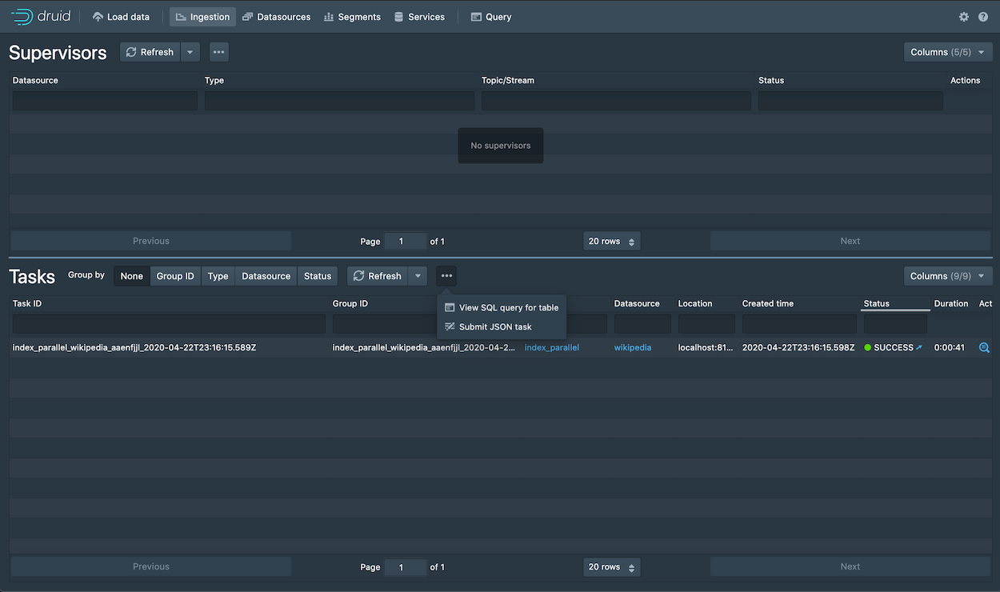
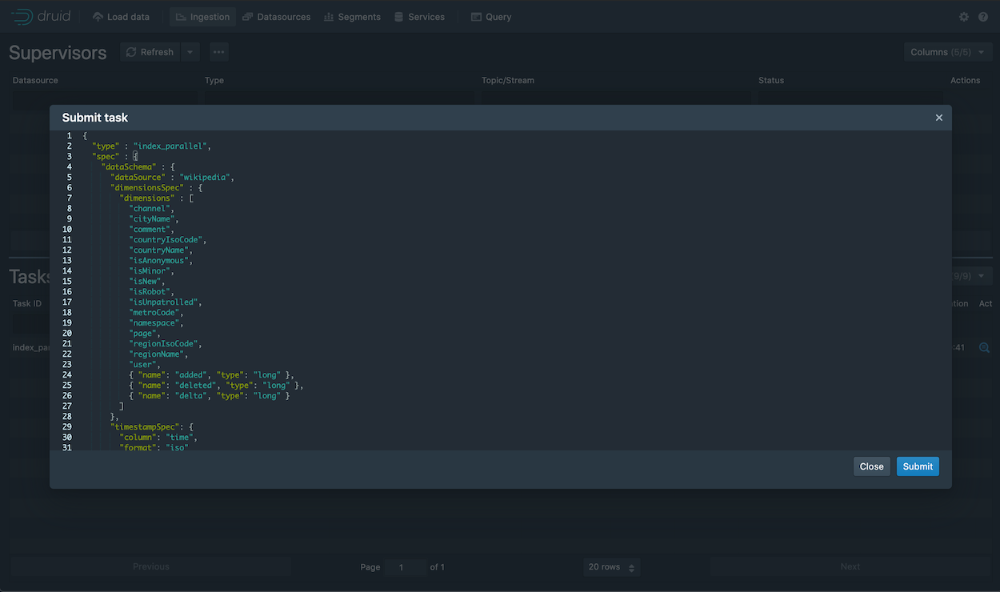

<!--
  ~ Licensed to the Apache Software Foundation (ASF) under one
  ~ or more contributor license agreements.  See the NOTICE file
  ~ distributed with this work for additional information
  ~ regarding copyright ownership.  The ASF licenses this file
  ~ to you under the Apache License, Version 2.0 (the
  ~ "License"); you may not use this file except in compliance
  ~ with the License.  You may obtain a copy of the License at
  ~
  ~   http://www.apache.org/licenses/LICENSE-2.0
  ~
  ~ Unless required by applicable law or agreed to in writing,
  ~ software distributed under the License is distributed on an
  ~ "AS IS" BASIS, WITHOUT WARRANTIES OR CONDITIONS OF ANY
  ~ KIND, either express or implied.  See the License for the
  ~ specific language governing permissions and limitations
  ~ under the License.
  -->


This tutorial demonstrates how to load data into Apache Druid from a file using Apache Druid's native batch ingestion feature.

You initiate data loading in Druid by submitting an *ingestion task* spec to the Druid Overlord. You can write ingestion 
specs by hand or using the _data loader_ built into the web console. 

For production environments, it's likely that you'll want to automate data ingestion. This tutorial starts by showing
you how to submit an ingestion spec directly in the web console, and then introduces ways to ingest batch data that
lend themselves to automation&mdash;from the command line and from a script. 

## Loading data with a spec (via console)

The Druid package includes the following sample native batch ingestion task spec at `quickstart/tutorial/wikipedia-index.json`, shown here for convenience,
which has been configured to read the `quickstart/tutorial/wikiticker-2015-09-12-sampled.json.gz` input file:

```json
{
  "type" : "index_parallel",
  "spec" : {
    "dataSchema" : {
      "dataSource" : "wikipedia",
      "dimensionsSpec" : {
        "dimensions" : [
          "channel",
          "cityName",
          "comment",
          "countryIsoCode",
          "countryName",
          "isAnonymous",
          "isMinor",
          "isNew",
          "isRobot",
          "isUnpatrolled",
          "metroCode",
          "namespace",
          "page",
          "regionIsoCode",
          "regionName",
          "user",
          { "name": "added", "type": "long" },
          { "name": "deleted", "type": "long" },
          { "name": "delta", "type": "long" }
        ]
      },
      "timestampSpec": {
        "column": "time",
        "format": "iso"
      },
      "metricsSpec" : [],
      "granularitySpec" : {
        "type" : "uniform",
        "segmentGranularity" : "day",
        "queryGranularity" : "none",
        "intervals" : ["2015-09-12/2015-09-13"],
        "rollup" : false
      }
    },
    "ioConfig" : {
      "type" : "index_parallel",
      "inputSource" : {
        "type" : "local",
        "baseDir" : "quickstart/tutorial/",
        "filter" : "wikiticker-2015-09-12-sampled.json.gz"
      },
      "inputFormat" :  {
        "type": "json"
      },
      "appendToExisting" : false
    },
    "tuningConfig" : {
      "type" : "index_parallel",
      "partitionsSpec": {
        "type": "dynamic"
      },
      "maxRowsInMemory" : 25000
    }
  }
}
```

This spec creates a datasource named "wikipedia".

From the Ingestion view, click the ellipses next to Tasks and choose `Submit JSON task`.



This brings up the spec submission dialog where you can paste the spec above.



Once the spec is submitted, wait a few moments for the data to load, after which you can query it.


## Loading data with a spec (via command line)

For convenience, the Druid package includes a batch ingestion helper script at `bin/post-index-task`.

This script will POST an ingestion task to the Druid Overlord and poll Druid until the data is available for querying.

Run the following command from Druid package root:

```bash
bin/post-index-task --file quickstart/tutorial/wikipedia-index.json --url http://localhost:8081
```

You should see output like the following:

```bash
Beginning indexing data for wikipedia
Task started: index_wikipedia_2018-07-27T06:37:44.323Z
Task log:     http://localhost:8081/druid/indexer/v1/task/index_wikipedia_2018-07-27T06:37:44.323Z/log
Task status:  http://localhost:8081/druid/indexer/v1/task/index_wikipedia_2018-07-27T06:37:44.323Z/status
Task index_wikipedia_2018-07-27T06:37:44.323Z still running...
Task index_wikipedia_2018-07-27T06:37:44.323Z still running...
Task finished with status: SUCCESS
Completed indexing data for wikipedia. Now loading indexed data onto the cluster...
wikipedia loading complete! You may now query your data
```

Once the spec is submitted, you can follow the same instructions as above to wait for the data to load and then query it.


## Loading data without the script

Let's briefly discuss how we would've submitted the ingestion task without using the script. You do not need to run these commands.

To submit the task, POST it to Druid in a new terminal window from the `apache-druid-33.0.0` directory:

```bash
curl -X 'POST' -H 'Content-Type:application/json' -d @quickstart/tutorial/wikipedia-index.json http://localhost:8081/druid/indexer/v1/task
```

Which will print the ID of the task if the submission was successful:

```bash
{"task":"index_wikipedia_2018-06-09T21:30:32.802Z"}
```

You can monitor the status of this task from the console as outlined above.


## Querying your data

Once the data is loaded, please follow the [query tutorial](../tutorials/tutorial-query.md) to run some example queries on the newly loaded data.


## Cleanup

If you wish to go through any of the other ingestion tutorials, you will need to shut down the cluster and reset the cluster state by removing the contents of the `var` directory under the druid package, as the other tutorials will write to the same "wikipedia" datasource.


## Further reading

For more information on loading batch data, please see [the native batch ingestion documentation](../ingestion/native-batch.md).
