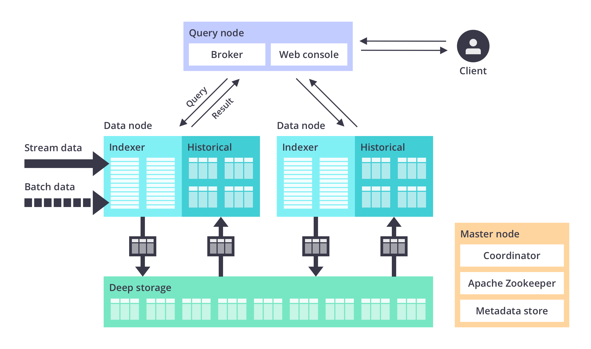

  

    <h1>Technology</h1>
  

Apache Druid is used to power real-time analytics applications that require fast queries at scale and under load on streaming and batch data. Druid features a unique distributed architecture across its ingestion, storage, and query layer to handle the scale needed for large aggregations with the performance needed for applications.

Druid is a services-based architecture that consists of independently scalable services for ingestion, querying, and orchestration, each of which can be fine-tuned to optimize cluster resources for mixed use cases and workloads. For example, more resources can be directed to Druid’s query service while providing less resources to ingestion as workloads change. Druid services can fail without impact on the operations of other services.

A Druid deployment is a scalable cluster of commodity hardware with node types that serve specific functions. In a small configuration, all of these nodes can run together on a single server (or even a laptop). For larger deployments, one or more servers are dedicated to each node type and can scale to thousands of nodes for higher throughput requirements.

<ul >
  <li>Master Nodes govern data availability and ingestion</li>
  <li>Query Nodes accept queries, manage execution across the system, and return the results</li>
  <li>Data Nodes execute ingestion workloads and queries as well as store queryable data</li>
</ul>

In addition, Druid utilizes a deep storage layer - cloud object storage or HDFS - that contains an additional copy of each data segment. It enables background data movement between Druid processes and also provides a highly durable data source to recover from system failures.

For more information, please visit [our docs page](../../docs/latest/design).

## Ingestion Layer

In Druid, ingestion, sometimes called indexing, is loading data into tables. Druid reads data from source systems, whether files or streams, and stores the data in segments.

When data is ingested into Druid, it is automatically indexed, partitioned, and, optionally, partially pre-aggregated (known as <a href="https://druid.apache.org/docs/latest/tutorials/tutorial-rollup.html">"rollup"</a>). Compressed bitmap indexes enable fast filtering and searching across multiple columns. Data is partitioned by time and, optionally, by other dimensions.

### Stream Data

Druid was designed from the outset for rapid ingestion and immediate querying of stream data upon delivery. No connectors are needed as Druid includes inherent exactly-once ingestion for data streams using Apache Kafka® and Amazon Kinesis APIs. Druid’s continuous backup into deep storage also ensures a zero RPO for stream data.

### Batch Data

Druid easily ingests data from object stores including HDFS, Amazon S3, Azure Blob, and Google Cloud Storage as well as data files from databases and other sources. The data files can be in a number of common formats, including JSON, CSV, TSV, Parquet, ORC, Avro, and Protobuf. Druid supports both SQL batch import and in-database transformations.

For more information, please visit [our docs page](/docs/latest/ingestion/).

## Storage Format

Druid stores data into segments. Each segment is a single file, typically comprising up to a few million rows of data. Each Druid table can have anywhere from one segment to millions of segments distributed across the cluster.

Within the segments, data storage is column-oriented. Queries only load the specific columns needed for each request. Each column’s storage is optimized by data type, which further improves the performance of scans and aggregations. String columns are stored using compressed dictionary encoding, while numeric columns are stored using compressed raw values.

For more information, please visit [our docs page](../../docs/latest/design/segments).

## Interactive Queries

Druid's interactive query engine is utilized for performance-sensitive queries. The query engine and storage format were designed together to provide maximum query performance using the fewest resources possible (as well as the best price for performance for mixed workloads). 

With this engine, Druid only reads from segments that are pre-loaded into memory or local storage in the data nodes. This ensures fast performance as data is co-located with computing resources and does not have to move across a network. Data is then queried using scatter/gather for optimal parallelization.

First, the query engine prunes the list of segments, creating a list of which segments are relevant to the query based on time-internals and other filters. Next, queries are divided into discrete pieces and sent in parallel to the data nodes that are managing each relevant segment or copy of that segment (“scatter”). On the data nodes, the sub-queries are processed and sent back to the query nodes to merge the final result set (“gather”).

Scatter/gather works from the smallest single server cluster (all of Druid on one server) to clusters with thousands of servers, enabling sub-second performance for most queries even with very large data sets of multiple petabytes.

For more information, please visit [our docs page](../../docs/latest/querying/).